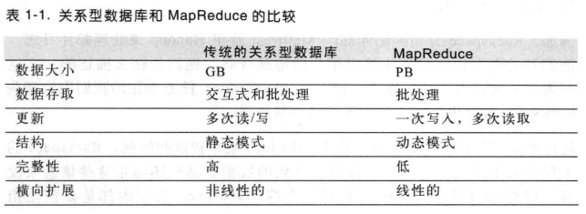

## 为什么不能用关系型数据库批量分析硬盘上的大规模数据，为什么需要MapReduce？
`第一、这两个问题源于计算机硬盘的趋势：寻址时间的提升远不如传输速率的提升。寻址是磁头移动到磁盘特定位置进行读写操作的过程。
它是导致磁盘延迟的主要原因，而传输速率取决于硬盘带宽。`
`第二、数据访问包含大量硬盘寻址，读取大量数据必然耗费更长时间；另一方面，如果只更新一小部分数据，传统的B树更有优势，
但是碰到大量数据更新，B树明显落后于MapReduce，因为使用“排序/合并”重建数据库。`
`第三、MapReduce适合批量处理整个数据集合的问题，尤其是动态问题。RDBMS适合点查询和更新。`
---
## RDBMS和MapReduce的比较

---
## MapReduce三大涉及目标
1. 为只需要几分钟或者几个小时的就可以完成的作业提供服务；
2. 运行于一个内部高速网路连接的数据中心内；
3. 数据中心内的计算机都是可靠的、定制的硬件。
---
## Hadoop起源
创始人Doug Cutting，同时也是Apache Lucene的创始人，Lucene是一个广泛应用的文本搜索库。
Hadoop起源于Apache Nutch，本身也是Lucene的一部分。
---
核心Hadoop项目简介
1. Common： 一系列组件和接口，用于分布式系统和通用I/O（序列化、Java RPC和持久化数据结构）；
2. Avro： 一种序列化系统，用于支持高效、跨语言的RPC和持久化数据存储；
3. MapReduce： 分布式数据处理模型和执行环境，运行于大型商用机集群；
4. HDFS： 分布式文件系统，运行于大型商用机集群；
5. Pig： 数据流语言和运行环境，用以探究庞大的数据集。Pig运行在MapReduce和HDFS集群上；
6. Hive： 一种分布式、按列存储的数据库。Hive管理HDFS中存储的数据，并提供基于SQL的查询语言；
7. HBase： 一种分布式、按列存储的数据库。HBase和HDFS作为底层存储，同时支持MapReduce的批量式计算和点查询（随机读取）；
8. ZooKeeper： 一种分布式、高可用的协调服务。Zookeeper提供分布式锁之类的基本服务用于构建分布式应用；
9. Sqoop： 用于结构化数据存储（如关系型数据库）和HDFS之间高效批量传输数据；
10. Oozie： 用于调度Hadoop作业。
---
## Hadoop

